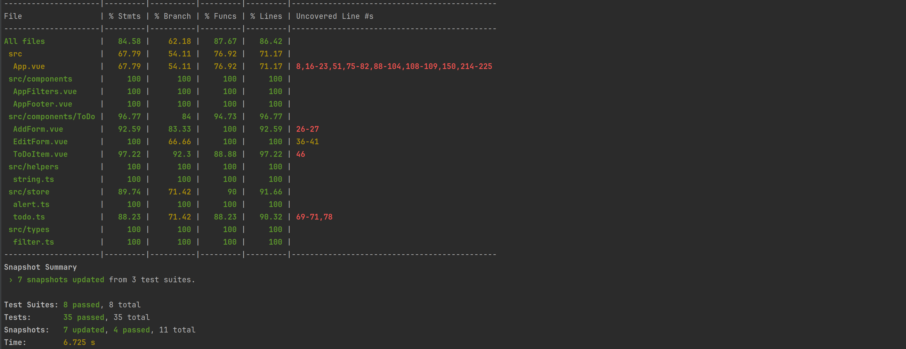

Демонстрационное приложение "Список дел" (Live demo: http://vue-todo-app.ratnikovmikhail.ru)

### Технологический стек

1. vue 3 (composition api)
2. pinia (какое-то время был vuex в качестве state менеджера). Выбран pinia,
   т.к:
   1. проще тестировать
   2. написан на typescript (лучшая поддержка ide, меньше магии)
   3. vue рекомендует в качестве state менеджера по умолчанию
3. jest (установлено минимальное покрытие в 75%)
   1. функциональные тесты компонентов + snapshots
   2. unit тесты state (pinia)
4. eslint (код стайл от airbnb)
5. prettier
6. sass + БЭМ
7. docker

### Code coverage

### Документация:

1. https://fakerjs.dev/api/
2. https://test-utils.vuejs.org/api/
3. https://vuejs.org/guide/introduction.html
4. https://pinia.vuejs.org/core-concepts/actions.html

### Разработка

1. запустить команду `make go`
2. перейти по адресу http://127.0.0.1:8200/
